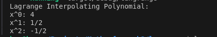
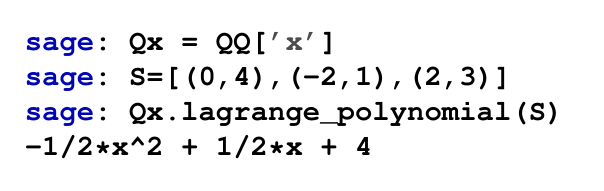

# langrange_interpolation

langrange interpolation can help in computing polynomials given a set of integers.

This is Rust implementation of Lagrange Interpolation using the given set S={(0,4),(−2,1),(2,3)}. This will compute a polynomial of degree 2 in Q[x]Q[x] with rational number coefficients.

Here is the result 

Here is the same calculation in SageMath 

